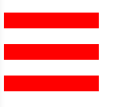
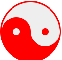

# 边框使用技巧

1. 取消边框 可以这样设置  border: 0 none; 这样写的性能更好 渲染性能最高

2. border-style: double 双线宽度永远相等，中间间隔正负1  

  例如： 使用这个实现等比例“三道杠”图标效果
  ```css
	<div id="icon"></div>
	#icon{
				margin-top: 50px;
				width: 120px;
				height: 20px;
				border-top: 60px double;
				border-bottom: 20px solid;
				border-color: red;
		}
  ```
  效果图：
    

  3.  border与透明边框的技巧  
  	3.1 在右下方background定位的技巧  
  		假设有个宽度不固定的元素，在其距离右边缘50px的位置设置一个背景图片 
  		```css
			.box{
				border-right: 50px solid transparent;
				background-position: 100% 50%; // 此时并不会把border-width的值算进去
			}
  		```  

  	  3.2 优雅地增加点击区域的大小  
  		当在手机端的时候有个小小的删除图标，由于比较小，手指不易操作，  
  		所以采用透明边框增加点击区域 
  		```css
			.icon-clear{
				width: 16px;
				height: 16px;
				border: 11px solid transparent;
			}
  		```
  		3.3 绘制图形  
  		绘制一个向下的等腰三角形  
  		```css
  		div{
				width: 0
				border: 10px solid;
				border-color: #f30 transparent transparent;
			}
  		```
  		绘制一个实色边框的转角连接
  		```css
  		#icon1{
				margin-top: 50px;
				width: 10px;
				height: 10px;
				border: 10px solid;
				border-color: #f30 #00f #396 #0f0;                         
			}
  		```
  		绘制一个一侧开口的三角形  
  		```css
  		div{
				width: 0;
				border-width: 20px 10px;
				border-style: solid;
				border-color: #f30 #f30 transparent transparent
			}
  		```
  		通过伪元素和边框实现  
  		  
  		```css
  		#dialog {
	      width: 200px;
	      height: 100px;
	      background-color: red;
	      position: relative;
	      margin: 0 auto;
	    }
	    #dialog::before {
	      content: '';
	      position: absolute;
	      right: 100%;
	      top: 38px;
	      width: 0;
	      height: 0;
	      border-right: 10px solid red;
	      border-top: 10px solid transparent;
	      border-bottom: 10px solid transparent;
	    }
  		```
  		通过双伪元素 和边框实现太极  
  		
  		```css
  		#yinyang {
	      width: 96px;
	      height: 48px;
	      background-color: #eee;
	      border-color: red;
	      border-style: solid;
	      border-width: 2px 2px 50px 2px;
	      border-radius: 100%;
	      position: relative;
	    }
	    #yinyang::before {
	      content: "";
	      position: absolute;
	      top: 50%;
	      left: 0;
	      background-color: #eee;
	      width: 12px;
	      height: 12px;
	      border: 18px solid red;
	      border-radius: 100%;
	    }
	    #yinyang::after {
	      content: "";
	      position: absolute;
	      top: 50%;
	      right: 0;
	      background-color: red;
	      width: 12px;
	      height: 12px;
	      border: 18px solid #eee;
	      border-radius: 100%;
	    }
  		```
